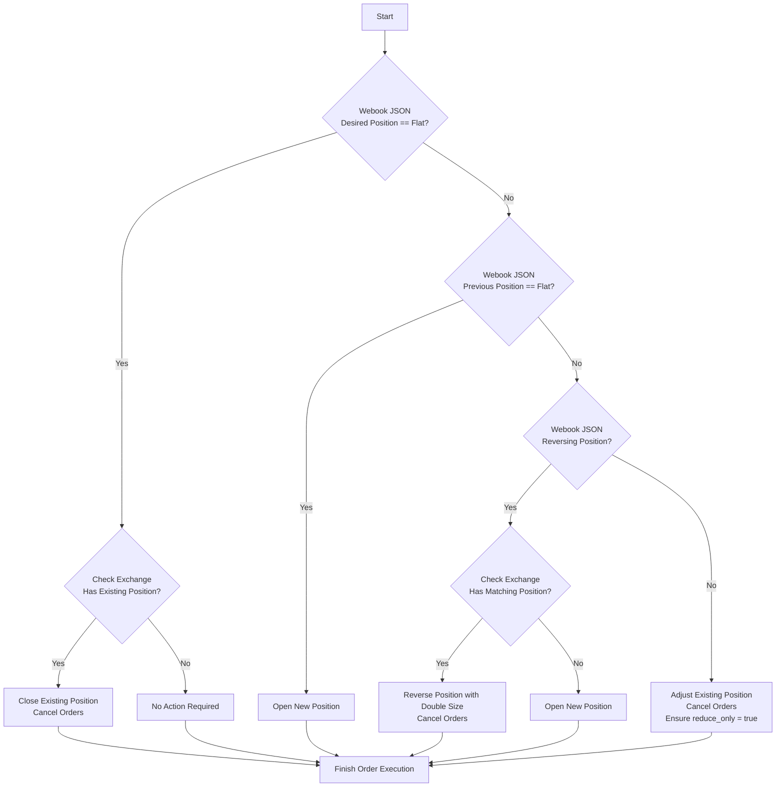

## Hyperliquid TradingView Connector

> [!NOTE]
>
> See [hyperliquid-python-sdk | GitHub] for documentation and authentication setup. 

> [!WARNING]
>
> In this repository, authentication isn't setup correctly and is un-documented on purpose, see the above repo instead.

## Function Deployment

For an updated walkthough, see [Deploy HTTP Function with Python | Google Docs]

```sh
gcloud functions deploy <function name> \
    --gen2 \
    --runtime=python310 \
    --region=us-west1 \
    --source=. \
    --entry-point=<main function name> \
    --trigger-http \
    --project <gcloud project name>
```

## Local Testing

[functions-framework-python] exposes a local helper for running your function and listening on port `8080`:

```sh
functions-framework-python --target hyper_http

curl --request POST \
  --url http://localhost:8080/ \
  --data '{
    "action": "buy",
    "ticker": "ETHUSDT",
    "position": "buy",
    "price": 3811.37
  }'
```

Keep in mind, if your code is pointed to the "live" exchange, and not the "testnet", this will execute "real" trades.


## State Machine



[functions-framework-python]: https://github.com/GoogleCloudPlatform/functions-framework-python
[Deploy HTTP Function with Python | Google Docs]: https://cloud.google.com/functions/docs/create-deploy-http-python
[hyperliquid-python-sdk | GitHub]: https://github.com/hyperliquid-dex/hyperliquid-python-sdk